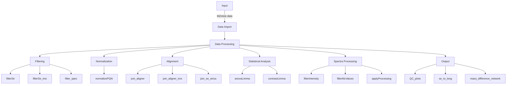

R package for downstream analysis of mass spectrometry data after peak picking with external software.

Funded by the German Federal Ministry of Education and Research and the state of Saxony-Anhalt as part of the project DiP-NA-WIR.

This package contains various functions used during analysis of 
    different metabolomics experiments. The main use is to simplify statistical
    workflows of output from other software like MZmine.

## Supported functionalities


## Install
Requires R language
```
git clone https://github.com/DavidRuescher95/mzReactionMineR.git
cd mzReactionMineR

R
> install.packages("BiocManager")
> devtools::install(".")
```

## Usage
See `main.R` for an example minimal workflow of how to use and combine functionalities of this project.

## Troubleshooting install:
No R on system and no sudo access -> use R within conda:
```
conda create -n r -c conda-forge r-base r-languageserver r-devtools
conda activate r

R
> install.packages("BiocManager")
> devtools::install(".")
```
no dev tool package installed or location cwd (".") not found
```
install.packages("devtools")

devtools::install(
  "path/to/your/mzReactionMineR",
  dependencies = TRUE,
)
```

